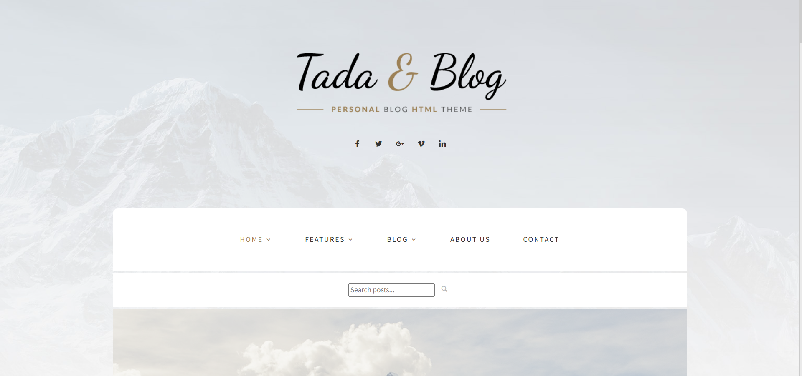
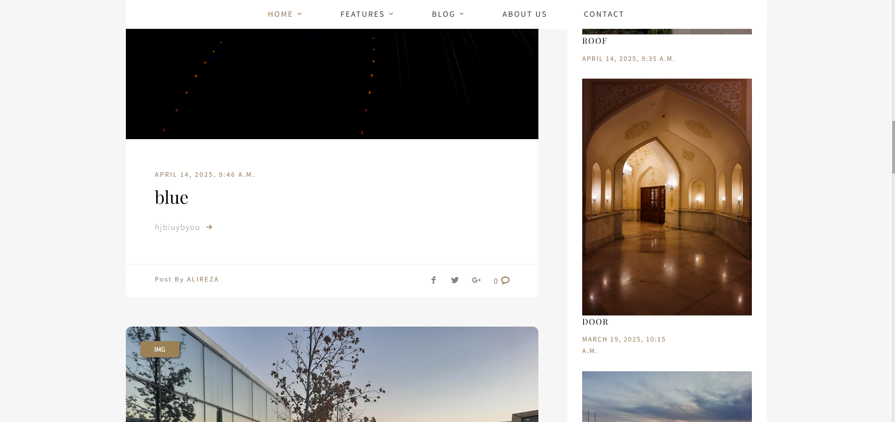
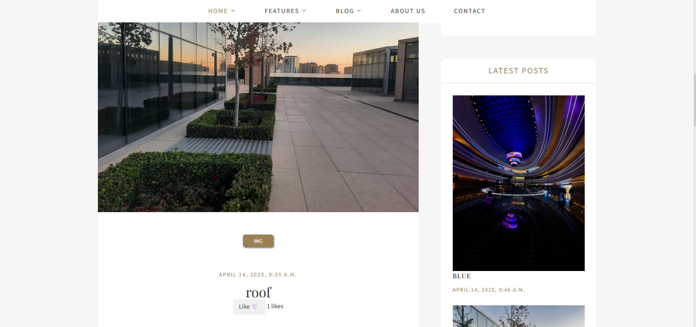
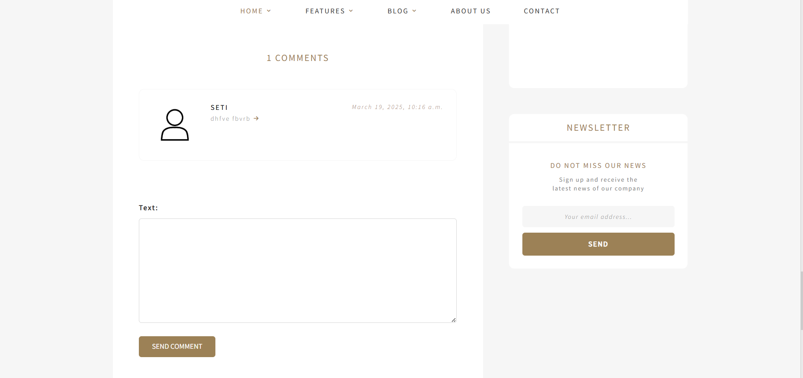

# 📝 Django Blog

A **full-featured blog application** built with **Django** and **Django Allauth**.  
This project includes **posts, categories, comments, likes, search, pagination**, and **user profiles**, all server-rendered using Django templates.

---

## 🚀 Features

| Feature | Explanation |
|---------|-------------|
| **🔐 Authentication** | Sign up, login, logout, and profile management using Django Allauth |
| **📝 Posts CRUD** | Create, edit, delete, and view posts |
| **🗂 Categories** | Organize posts into categories |
| **💬 Comments** | Users can comment on posts |
| **❤️ Likes** | Users can like posts |
| **🔍 Search** | Search posts by title or content |
| **📄 Pagination** | Posts are paginated for easy browsing |
| **👤 Profiles** | User profile page to edit the profile |

---

## 🧠 Tech Stack

| Component | Technology |
|-----------|------------|
| **Backend** | Django, Django Allauth |
| **Database** | SQLite |
| **Frontend** | Django Templates (HTML, CSS, Bootstrap optional) |
| **Pagination & Search** | Django built-in tools |

---

## 🛠 Installation

### 1. Clone the repository

```bash
git clone https://github.com/YourUsername/your-blog-project.git
cd your-blog-project
```

### 2. Create a virtual environment

```bash
python -m venv venv
source venv/bin/activate   # For Linux/Mac
venv\Scripts\activate      # For Windows
```

### 3. Install dependencies

```bash
pip install -r requirements.txt
```

### 4. Apply migrations

```bash
python manage.py migrate
```

### 5. Create superuser

```bash
python manage.py createsuperuser
```

### 6. Run the server

```bash
python manage.py runserver
```

---

## 📌 Demo Flow

1. Users can **sign up** or **login**.  
2. Create a **post** and assign a **category**.  
3. Users can **like** and **comment** on posts.  
4. **Search** posts by keywords.  
5. Posts are displayed with **pagination**.  
6. Each user has a **profile page** to edit their profile.

---

## 🖼️ Screenshots

### Home Page



### Post Page



---

## 👤 Author

**Anita Masdoodi**  
Full-Stack Developer — Django / Python
